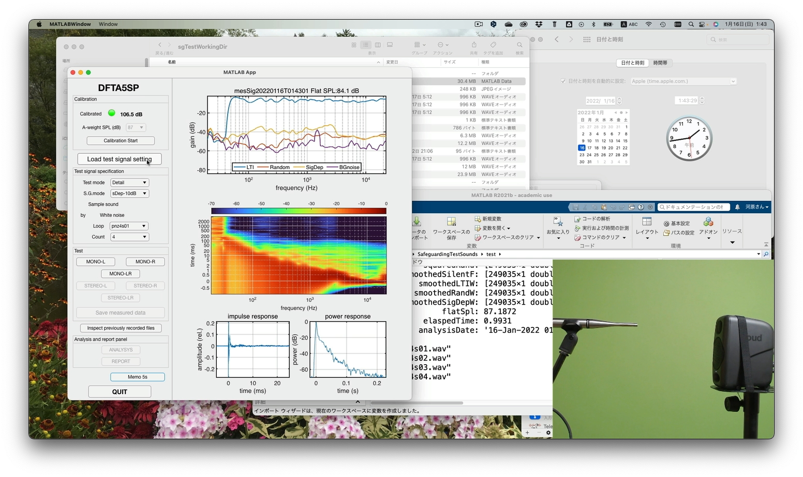

# SafeguardingTestSounds
Acoustic measurement using music pieces (and any other sounds).

## Directories
* app Acoustic measurement application
* test Warehouse of old test codes

## Application
* dfta5sp.mlapp MATLAB application  

### Install
Copy three folders to set working directories

### How to start
Type "dfta5sp" inside MATLAB command window.

The following video have a tutorial

## Technical reference
Please refer to the following article:

[Safeguarding test signals for acoustic measurement using arbitrary sounds, by Hideki Kawahara and Kohei Yatabe][http://arxiv.org/abs/2112.11373]

## Release memo

 Kick start by adding application
 
